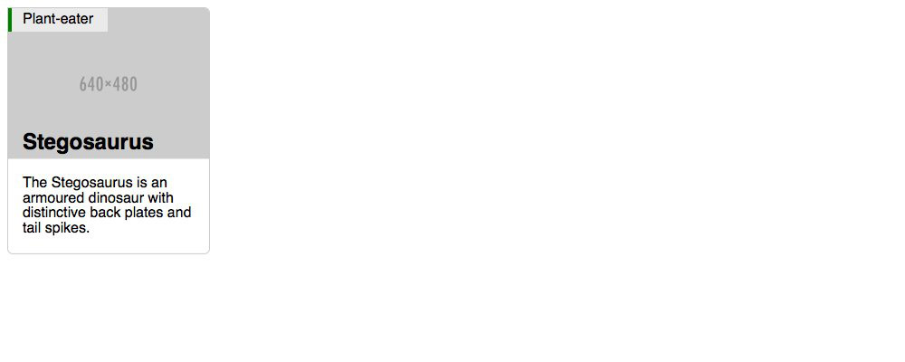

# Making-an-image-card
Goal We’re going to look at how to make the image card pattern, concentrating on position absolute and relative.  This is what it should look like when it’s done:  see screenshots folder

you will need to shrink browser to match screenshot (Approx size is mobile ~ 240 - 320
